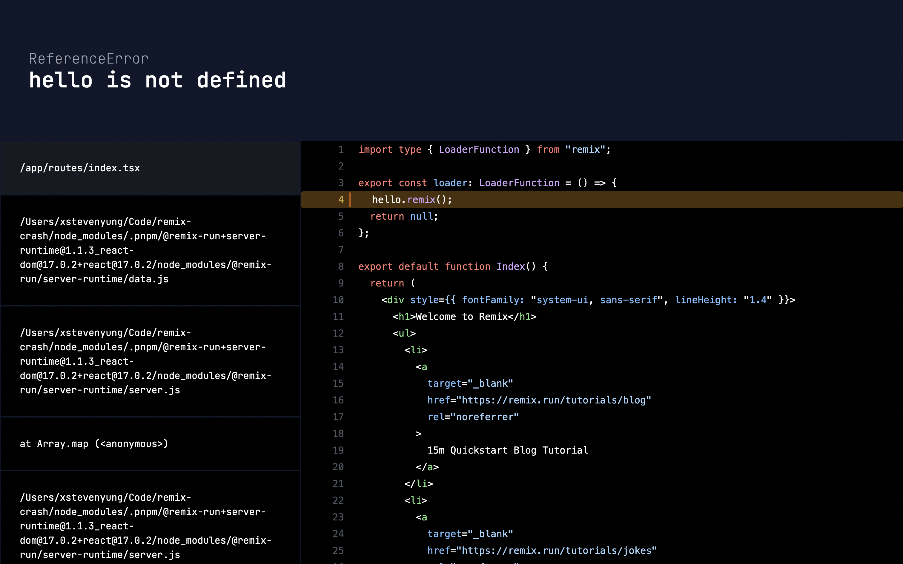

# Remix Crash

A root development `<ErrorBoundary />` for your Remix apps.



## Overview

Remix Crash is a development overlay to simplify debugging during your development process.

**Warning**: Remix Crash is still quite recent, use at your own risk.

## Getting Started

### Installation

```bash
npm install remix-crash
```

### Setup

#### In `app/root.tsx`

```jsx
export default function App() {
  return {
    /* Your app */
  };
}

// Add this line
export { ErrorBoundary } from "remix-crash";
```

#### In `app/routes/_remix-crash.jsx`

```jsx
export { loader, action } from "remix-crash/server";
```

#### All set

You should be all set from here.

## Advanced

### Production Error Boundary

While Remix Crash provides a simple Production Error Boundary with less information. You might want to customize that page.

If you choose to do so, you will just need to replace the `<ErrorBoundary />` component in your `app/root.jsx`:

```jsx
// app/root.jsx
// 1. Import the ErrorBoundary
import { DevErrorBoundary } from "remix-crash";

export default function App() {
  return {
    /* Your app */
  };
}

// 2. Define your custom error boundary while using Remix Crash for development environment
export function ErrorBoundary({ error }) {
  if (process.env.NODE_ENV === "development") {
    return <DevErrorBoundary error={error} />;
  }

  // here goes your custom production Error Boundary
  return (
    <div>
      <p>Oops something very wrong happened...</p>
    </div>
  );
}
```
